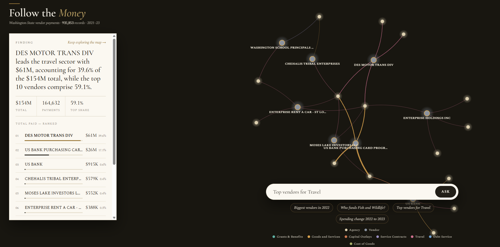
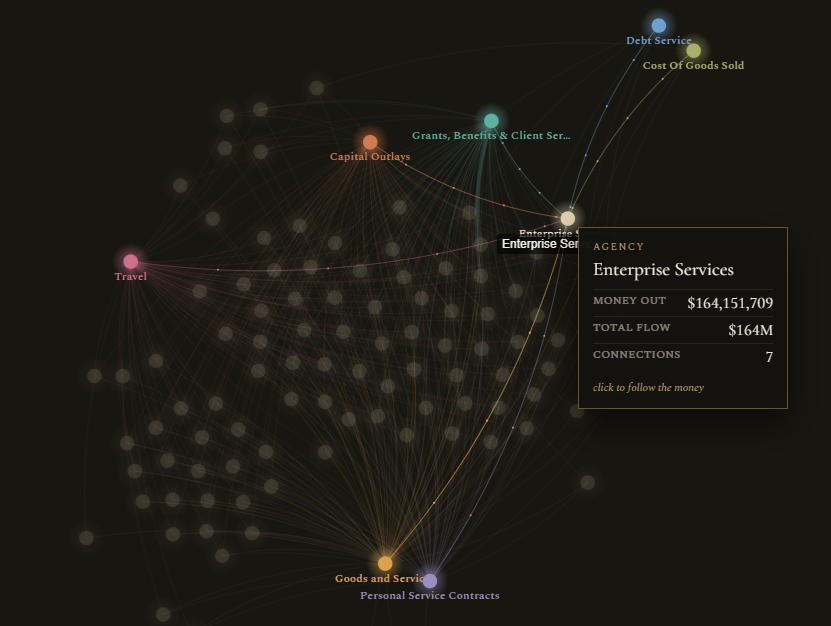
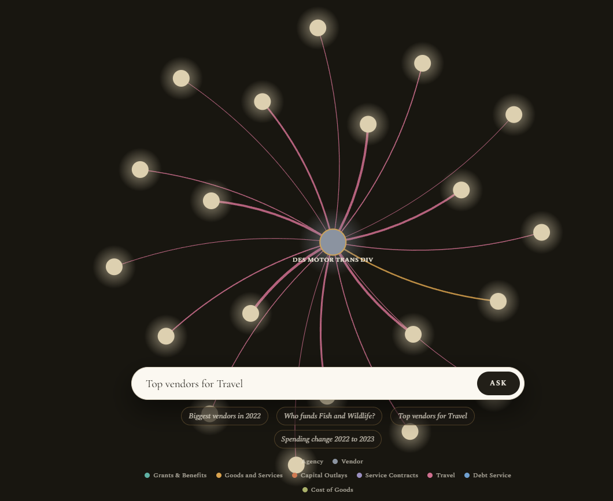

# Follow the Money — a living ledger of Washington State spending

A working proof-of-concept that lets a **non-technical investigative journalist** interrogate
935,853 government vendor‑payment records as **one interactive money‑flow graph** — by asking
plain‑English questions. No SQL, no spreadsheets, no BI training.

> Type *"who got paid the most in 2022?"* → the map transitions to that answer, and a short,
> trustworthy finding appears beside it. Click any node to follow the money further.

**▶ Live demo:** https://follow-the-money-io1n.onrender.com/
*(free Render instance — first load may take ~30s to wake. Works without an API key via a keyword fallback.)*

**Stack:** TypeScript · React (Vite) · Express · OpenAI (`gpt-4o-mini`) · `react-force-graph-2d`.
**Data:** WA State `Vendor-Payments_2021-23.xlsx` (2 sheets, ~936K rows), parsed to an in‑memory cache.

---

## What it looks like

The resting state — every agency and the 7 spending categories, edges colored by *what* the money was for:


| Ask a question → the map answers | Hover any node |
|---|---|
|  |  |
| *Plain English in → the graph transitions to the answer, with a Finding card of code‑computed numbers.* | *Money in / money out / connections, on hover.* |

Click any node to **follow the money** into its neighborhood:



---

## 1. Problem

**The user.** An investigative journalist (or policy analyst) handed the state's vendor‑payment
file. The data is public and important — *who does the government pay, how much, for what* — but
it's a 49 MB, 936K‑row spreadsheet across two fiscal‑year tabs. To get a single story lead today
you need Excel pivot skills or SQL. That's a wall between the reporter and the story.

**The pain I addressed — making the *direction* of money legible.** The hard part isn't a single
number; it's seeing the **flow**. One agency pays many different vendors, and those same vendors
are in turn paid by *other* agencies. Trace that web and you can see **where public money starts
and where it finally ends up** — which is the whole point of "follow the money." A spreadsheet
buries this completely; a network of points and edges shows it at a glance. So the product is a
**directed money‑flow graph you ask questions of**: every node is an agency or a vendor, every
edge is real dollars moving in a direction, colored by *what* the money was for. The plain‑English
ask bar is just the fastest way to point the graph at the part of the web you care about.

**Why this direction (over a dashboard or a chat box).**
- A **dashboard** makes the user do the analysis by staring at charts. A journalist wants the
  *conclusion*, then the ability to dig. So the answer is one finding + one focused view, not ten
  widgets.
- A **pure chatbot** hides structure. "Follow the money" is inherently relational, so the hero is
  a **knowledge‑graph** the user interrogates; the AI is the way *in*, not the output itself.
- The result is one screen: a full‑bleed graph with an ask bar. Ask → the whole map breathes
  down to the answer. That's the "Canva for data" promise — value without the tools.

---

## 2. Tech & architectural choices

### How it works (one sentence)
The AI turns a question into a **structured query**; **our code computes every number** and
builds the **graph constellation** that answers it; the AI then writes **one sentence** from the
numbers our code already produced.

```
question ──▶ OpenAI parse ──▶ Query{metric,groupBy,filter}
                 (logged)            │
                                     ├─▶ engine.runQuery()  → exact numbers   (code, never AI)
                                     └─▶ answerGraph()       → nodes + edges    (code)
                                     │
            computed numbers ──▶ OpenAI summarize ──▶ one-line finding (logged)
```

### Key decisions & trade‑offs (named on purpose)

1. **AI parses intent; code owns the numbers.** OpenAI only emits a query object and rephrases a
   pre‑computed sentence — it never adds up dollars. *Trade‑off:* slightly more prompt
   engineering and a deterministic fallback to maintain, in exchange for **auditable, never
   hallucinated** figures. For a journalist, a wrong dollar amount is a credibility disaster, so
   this line is non‑negotiable. (See `server/ai.ts` vs `server/engine.ts`.)

2. **In‑memory cache, not a database.** A build step (`scripts/convert_data.py`) converts the
   49 MB xlsx into a 27 MB dictionary‑encoded JSON the server loads in ~300 ms; queries scan it
   in tens of ms. *Trade‑off:* a derived cache file + full‑scan queries vs. a real indexed DB.
   Right for a POC; **the .xlsx stays the single source of truth** (the JSON is a build artifact,
   like compiled code).

3. **The graph shows bounded views, not all 97K vendors at once.** A literal 97K‑node force graph
   is an unreadable, un‑renderable hairball. Instead: the resting state is the **whole system**
   (102 agencies × the 7 spending categories), and individual vendors **bloom in** when you ask or
   click. *Trade‑off:* "everything at once" for legibility + insight‑per‑pixel.

4. **Category as edge color (9 categories), not extra nodes.** Edges are colored by the dominant
   spending category, so you read *what the money is for* without clutter. Cheap because there are
   exactly nine categories.

5. **Reimbursements excluded by default.** Interagency / intra‑agency transfers (`Object` S/T)
   double‑count real outflow and contain the $700M+ "giants," so they're filtered out — what
   remains is money to *outside* vendors. A defensible default the journalist can trust.

### Data handling for the AI (hard constraint)
Every input sent to the model passes through a single choke‑point, `logAiInput()` in
`server/ai.ts`, which records the timestamp, the user's question, the **exact payload sent**, and
the model name to console + `logs/ai-inputs.log`. The payloads are deliberately tiny (a query
spec or a few computed numbers) — never raw rows — which keeps logging trivial and avoids sending
the dataset to a third party. *In production* this would write to a managed sink (Datadog /
BigQuery) with retention and PII review.

### What I deferred (out of scope, on purpose)
Auth, a real database, a raw‑records audit table, write/refresh pipelines, a test suite,
accessibility pass, and a true GPU "all‑97K" map. The README and code call these out rather than
pretending they're done.

### What would change for production
Source of truth → Postgres/BigQuery with indexes (the AI emits a query, the DB returns only
aggregates); AI‑input logs → a managed observability sink; add caching/rate‑limiting on the
OpenAI route; schema‑validate the model's query output server‑side; and a layout service for
larger graphs.

---

## 3. AI usage log

Three significant moments where I worked with — and pushed back on — the AI (Claude Code as the
pair‑programmer; OpenAI in‑app). The full blow‑by‑blow is in `dump.md` (internal notes).

**1 — "Let the AI do the math" → rejected.** When designing the pipeline, the obvious move was to
hand the model the matching rows and let it compute and summarize. **I rejected letting the model
produce any figure.** Responsibilities are split hard: AI interprets intent (`ai.ts`), a
deterministic engine computes (`engine.ts`). *Why:* trustworthy, auditable numbers for a
journalist.

**2 — The AI narrated a real number with the wrong meaning → redirected (the key moment).** Asked
to summarize "the ten biggest recipients," the model wrote *"the ten largest recipients received a
total of $33.7 billion."* The $33.7B was **real** but it's the *all‑vendors* total, not the top
ten (≈41% of it) — a misattribution, not a hallucinated value. Prompt tweaks didn't fix it
reliably, so **I changed the architecture**: `composeSummary()` now builds the factual sentence in
code, and the model may only *rephrase it without changing any number*. It now structurally
*cannot* misattribute a figure. Result: *"Molina Healthcare received $5.3B, 15.6% of the $33.7B
total, with the top 10 accounting for 41.5%."* ✅

**3 — Two parsing bugs caught by testing against ground truth.** (a) For "change from 2022 to
2023," the model set a single‑year filter and collapsed the trend to one point — fixed with an
explicit prompt rule (and the same bug fixed in the keyword fallback). (b) "Who are the vendors
for X" was parsed as *count, ascending* (fewest payments) — meaningless; redirected the prompt so
open "who/which" questions rank by dollars, descending. I also made agency/category filters
resolve fuzzily server‑side so a near‑miss name doesn't silently return zero rows.

**The line I drew:** the AI may interpret intent and phrase language; it may never produce a
number or decide what a number means. That lives in code.

---

## Running it

```bash
# 1. install
npm install

# 2. build the data cache from the .xlsx (one time)
npm run convert            # needs Python + `pip install openpyxl`

# 3. add your OpenAI key (optional — app works without it via a keyword fallback)
cp .env.example .env       # then set OPENAI_API_KEY

# 4. run (server :8787 + web :5173)
npm run dev
# open http://localhost:5173
```

No key? The app still runs end‑to‑end using a deterministic keyword parser and a code‑composed
summary — useful proof that the numbers never depend on the model.

## Deploy (Render)

The app is a single Node service: in production the Express server serves both the built React
app and the `/api` routes from one port (`render.yaml` is included). Steps:

1. **Commit the data cache.** `data/dataset.json` is intentionally committed (the source `.xlsx`
   is behind Provn auth and can't be regenerated on the host).
2. Push the repo to GitHub.
3. On Render: **New → Blueprint**, point it at the repo (it reads `render.yaml`), and set
   `OPENAI_API_KEY` in the dashboard (optional — without it the app uses the keyword fallback).

Render runs `npm install --include=dev && npm run build` then `npm run start` with
`NODE_ENV=production`. Verified locally: `NODE_ENV=production PORT=8080 npm run start` serves the
app and API on one origin. (Vercel works too but is a worse fit — serverless cold‑starts reload
the 27 MB dataset; a long‑running Node host matches the in‑memory design.)

## Project layout
```
scripts/convert_data.py   xlsx → compact JSON cache (the .xlsx stays source of truth)
shared/                   types, formatters, category palette (used by server + web)
server/                   Express API: engine (numbers), graph builders, ai (parse/summarize + logging)
web/                      React app: the full-bleed graph, ask bar, answer card
logs/ai-inputs.log        every input sent to the model (hard-constraint #3)
dump.md                   internal build notes (gitignored) — not a deliverable
```
